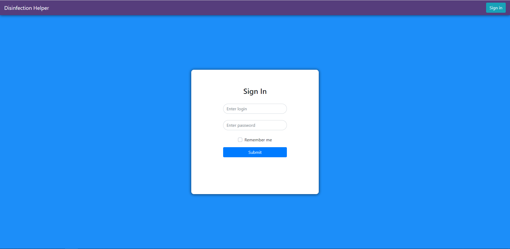
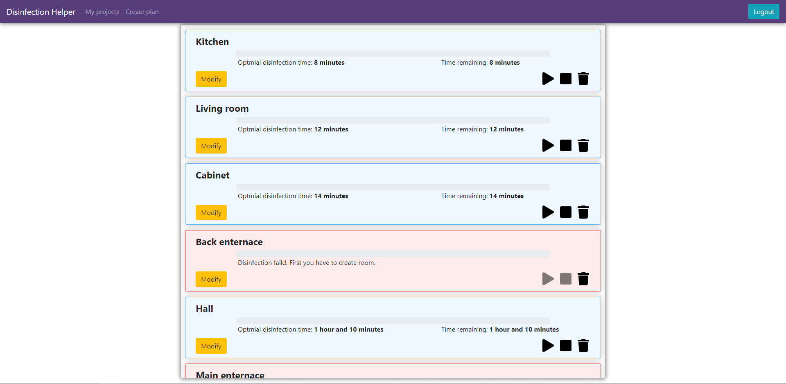
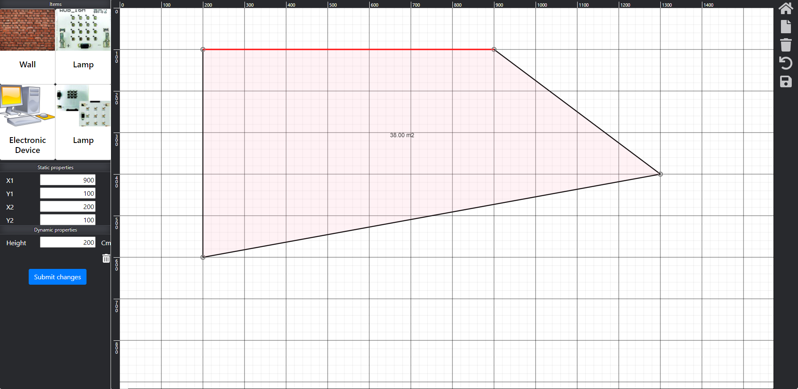

# Table of contents

- [General info](#general-info)
- [Site](#site)
- [Setup](#setup)
- [Technologies](#technologies)
- [License](#License)

# General info

The webapp used make 2d room projects and carry out simulation of disinfection process. You can create your own room you want to disinfect. There are several UV lamps you can choose from. As soon as the create is room app caculates time needed to perform successful disinfection process.
</br>
</br>

# Site

## Login page


</br>
</br>

## Project list


</br>
</br>

## Room planer


</br>
</br>

# Setup

There are 2 ways to start this project:

## Basic setup

To run frontend of this project, install it locally using npm:

```
$ cd web
$ npm install
$ npm start
```

In order to make backend work you have to install PostgreSQL on your local mahcine. One also have to add connection string in appsettings.json file or add it in some other way like with help of environment variables.

</br>

<!-- ## Docker

</br>
</br> -->

# Technologies

Project has been created with:

- Frontend
  - React (entirely on hooks)
  - React-bootstrap
  - React-konva
  - React-router
  - Many more smaller libraries
- Backend
  - ASP<span>.NET Core
  - PostgreSQL
  - NLog
  - FluentScheduler
  - FluentNhibernate
  - SignalR
    </br>
    </br>

# License

> You can check out the full license [here](https://github.com/IgorAntun/node-chat/blob/master/LICENSE)

This project is licensed under the terms of the **MIT** license.
